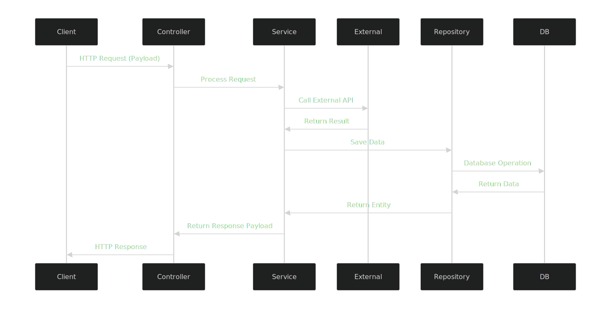

# Achievia - Competitive Programming & Learning Platform 🏆

<div align="center">

[](https://spring.io/projects/spring-boot)  
[](https://www.oracle.com/java/)  
[](https://www.mysql.com/)  
[](https://jwt.io/)  

🚀 Transform Your Coding Skills Through Competition and Community  

[](LICENSE)  
[](https://github.com/YeamimHossainSajid/Achievia/issues)  
[](https://github.com/YeamimHossainSajid/Achievia/network/members)  
[](https://github.com/YeamimHossainSajid/Achievia/stargazers)  

</div>

---

## 📖 Table of Contents

- [Overview](#overview)  
- [Features](#features)  
- [System Architecture](#system-architecture)  
- [Tech Stack](#tech-stack)  
- [Installation](#installation)  
- [API Documentation](#api-documentation)  
- [Database Schema](#database-schema)  
- [Workflows](#workflows)  
- [Contributing](#contributing)  
- [License](#license)  
- [Support](#support)  
- [Acknowledgments](#acknowledgments)  

---

## 🎯 Overview

**Achievia** is a comprehensive competitive programming platform designed to help developers enhance their coding skills through structured competitions, real-time feedback, and community engagement.  

Built with **Spring Boot 3** and **Java 21**, Achievia provides a robust backend for coding challenges, user progression tracking, and competition management.  

> "Where Code Meets Growth" – Bridging the gap between learning and competitive programming excellence.

---

## 💡 The Problem We Solve

| Problem             | Industry Impact                                 | Our Solution                                                   |
|---------------------|-----------------------------------------------|------------------------------------------------------------------|
| Skill Stagnation    | 68% of developers plateau after 2 years        | Progressive Learning Paths with continuous challenge escalation |
| Isolated Learning   | Limited peer feedback and collaboration        | Community Code Reviews & real-time pair programming             |
| Poor Interview Prep | 45% failure rate in technical interviews       | Real-world Scenario Simulations with company-specific challenges|
| No Progress Tracking| Difficulty measuring coding improvement        | AI-Powered Analytics Dashboard with skill metrics               |


## ✨ Features

### 🏆 Core Features
- **Real-time Coding Competitions**: Time-bound challenges with live leaderboards  
- **Multi-language Support**: Java, Python, C++, JavaScript, and more  
- **Intelligent Problem Management**: Curated problem sets with progressive difficulty  
- **Performance Analytics**: Execution time, memory usage, and code quality metrics  
- **User Progression System**: XP, levels, and achievements tracking  

### 🎯 User Experience
- **Personalized Learning Paths**: Adaptive problem recommendations  
- **Community Engagement**: Code reviews, discussions, and mentorship programs  
- **Portfolio Building**: Showcase rankings and solved problems  
- **Mobile Responsive**: Works seamlessly across all devices  

### 🔧 Technical Features
- **RESTful API**: Clean, well-documented endpoints  
- **JWT Authentication**: Secure token-based authentication  
- **Code Execution Sandbox**: Secure code execution using Judge0 API  
- **Real-time Notifications**: Updates on competitions and results  

---
## 🎮 Gamification Engine

```java
@Component
public class GamificationEngine {

    public AchievementResult checkAchievements(UserEvent event) {
        return CompletableFuture.supplyAsync(() -> {
            // Real-time achievement processing
            List<Achievement> unlocked = achievementValidator
                .validate(event)
                .stream()
                .filter(Achievement::isUnlocked)
                .collect(Collectors.toList());
            
            return new AchievementResult(unlocked, calculateXP(event));
        });
    }
}
```


## 🏗️ System Architecture

### High-Level Architecture



# Achievia - Project Architecture

## Package Structure Breakdown

```
src/main/java/com/yeamim/achievia/
├── 📁 feature/                    # Modular Feature Packages
│   ├── 👤 user/                   # Complete User Module
│   │   ├── controller/            # Handles all API endpoints related to users
│   │   │   └── UserController.java
│   │   ├── service/               # Business logic & operations
│   │   │   └── UserService.java
│   │   ├── repository/            # Database access for user entities
│   │   │   └── UserRepository.java
│   │   ├── entity/                # User data model
│   │   │   └── UserEntity.java
│   │   └── payload/               # DTOs for requests & responses
│   │       ├── UserRequest.java
│   │       ├── UserResponse.java
│   │       └── ProfileUpdateRequest.java
│   │
│   ├── 🏆 competition/            # Complete Competition Module
│   │   ├── controller/
│   │   │   └── CompetitionController.java
│   │   ├── service/
│   │   │   └── CompetitionService.java
│   │   ├── repository/
│   │   │   └── CompetitionRepository.java
│   │   ├── entity/
│   │   │   └── CompetitionEntity.java
│   │   └── payload/
│   │       ├── CompetitionRequest.java
│   │       ├── CompetitionResponse.java
│   │       └── JoinCompetitionRequest.java
│   │
│   ├── 💻 problem/               # Complete Problem Module
│   │   ├── controller/
│   │   │   └── ProblemController.java
│   │   ├── service/
│   │   │   └── ProblemService.java
│   │   ├── repository/
│   │   │   └── ProblemRepository.java
│   │   ├── entity/
│   │   │   └── ProblemEntity.java
│   │   └── payload/
│   │       ├── ProblemRequest.java
│   │       ├── ProblemResponse.java
│   │       └── TestCaseRequest.java
│   │
│   ├── 📤 submission/            # Complete Submission Module
│   │   ├── controller/
│   │   │   └── SubmissionController.java
│   │   ├── service/
│   │   │   └── SubmissionService.java
│   │   ├── repository/
│   │   │   └── SubmissionRepository.java
│   │   ├── entity/
│   │   │   └── SubmissionEntity.java
│   │   └── payload/
│   │       ├── SubmissionRequest.java
│   │       ├── SubmissionResponse.java
│   │       └── CodeExecutionRequest.java
│   │
│   └── 💬 chat/                  # Complete Chat Module
│       ├── controller/
│       │   └── ChatController.java
│       ├── service/
│       │   └── ChatService.java
│       ├── repository/
│       │   └── ChatRepository.java
│       ├── entity/
│       │   └── ChatMessageEntity.java
│       └── payload/
│           ├── ChatMessageRequest.java
│           ├── ChatMessageResponse.java
│           └── TypingNotificationRequest.java
│
├── 🔐 auth/                      # Complete Auth Module
│   ├── controller/
│   │   └── AuthController.java
│   ├── service/
│   │   └── AuthService.java
│   ├── repository/
│   │   └── AuthRepository.java
│   ├── entity/
│   │   └── AuthEntity.java
│   └── payload/
│       ├── LoginRequest.java
│       ├── RegisterRequest.java
│       ├── AuthResponse.java
│       └── TokenRefreshRequest.java
│
├── ⚙️ config/                    # External Service Configurations
│   ├── CohereConfig.java
│   ├── CloudinaryConfig.java
│   ├── SmtpConfig.java
│   ├── JwtConfig.java
│   ├── WebSocketConfig.java
│   ├── Judge0Config.java
│   └── SecurityConfig.java
│
└── AchieviaApplication.java       # Spring Boot Main Class
```
## Data Flow Per Module



## Module Architecture Benefits

### 🎯 Modular Design Advantages
- **Independent Development:** Each module can be developed and tested separately  
- **Clear Separation:** Business logic isolated in respective modules  
- **Easy Maintenance:** Changes in one module don't affect others  
- **Scalable:** New features can be added as separate modules  
- **Team Collaboration:** Different teams can work on different modules  

---

## 📊 Module Responsibilities

| Module        | Controller          | Service            | Repository       | Entity           | Payload                  |
|---------------|------------------|-----------------|----------------|----------------|-------------------------|
| User          | User endpoints     | Business logic  | Data access     | User data       | Request/Response DTOs   |
| Competition   | Competition APIs   | Competition logic | Competition data | Competition model | Competition DTOs      |
| Problem       | Problem CRUD       | Problem management | Problem data  | Problem model   | Problem DTOs           |
| Submission    | Code submission    | Code execution  | Submission data | Submission model | Submission DTOs        |
| Chat          | Message handling   | Real-time logic | Message data    | Message model   | Message DTOs           |
| Auth          | Login/Register     | Auth logic      | User auth data  | Auth model      | Auth DTOs              |

---

## 🔄 External Services Integration Flow



This highly modular architecture ensures each feature is self-contained with its own complete stack:

**Controller → Service → Repository → Entity → Payload**  

This makes your codebase **extremely maintainable, testable, and scalable**. 🚀


