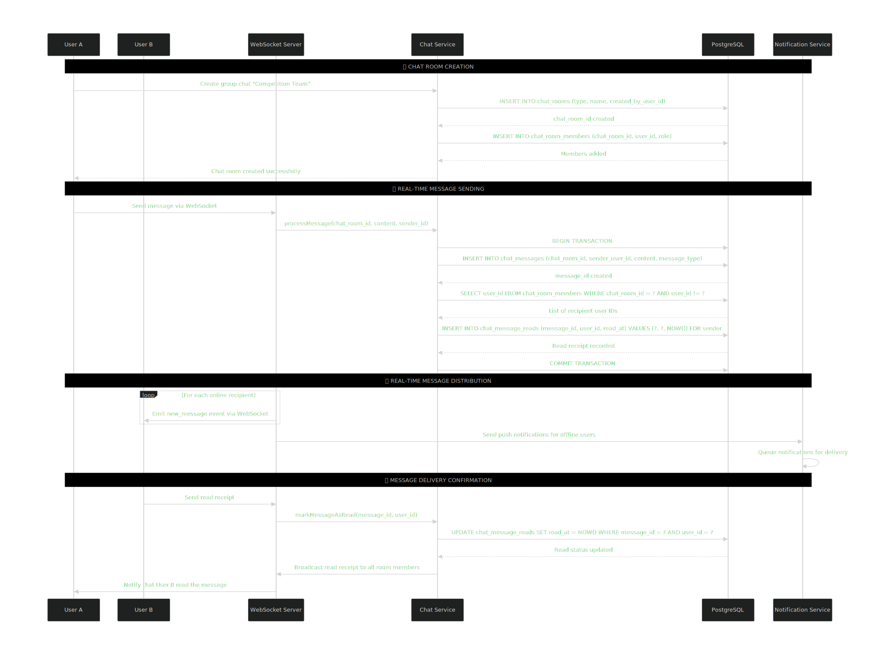

<div align="center">
  <h1>Achievia - Competitive Programming & Learning Platform</h1>
</div>


 

<div align="center">

**Transform Your Coding Skills Through Competition and Community**   

<!-- Tech Stack Badges -->
<p>
  <a href="https://spring.io/projects/spring-boot"></a>
  <a href="https://www.oracle.com/java/"></a>
  <a href="https://www.postgresql.org/"></a>
  <a href="https://jwt.io/"></a>
</p>

<!-- Project Stats Badges -->
<p>
  <a href="LICENSE"></a>
  <a href="https://github.com/YeamimHossainSajid/Achievia/issues"></a>
  <a href="https://github.com/YeamimHossainSajid/Achievia/network/members"></a>
  <a href="https://github.com/YeamimHossainSajid/Achievia/stargazers"></a>
</p>

</div>


---

## Table of Contents

1. Overview
2. The Problem We Solve
3. Features
4. System Architecture
5. Database Design & Optimization
6. Project Architecture
7. Real-time Chat System
8. Gamification & Habit Engine
9. Key Business Logic Flows
10. Real-time Leaderboard System
11. Installation & Setup Guide
12. Business Model
13. Contributing
14. License
15. Support
16. Acknowledgments


## Overview

**Achievia** is a comprehensive competitive programming platform designed to help developers enhance their coding skills through structured competitions, real-time feedback, and community engagement.  

Built with **Spring Boot 3** and **Java 17**, Achievia provides a robust backend for coding challenges, user progression tracking, and competition management.  

> "Where Code Meets Growth" – Bridging the gap between learning and competitive programming excellence.

---

##  The Problem We Solve

| Problem             | Industry Impact                                 | Our Solution                                                   |
|---------------------|-----------------------------------------------|------------------------------------------------------------------|
| Skill Stagnation    | 68% of developers plateau after 2 years        | Progressive Learning Paths with continuous challenge escalation |
| Isolated Learning   | Limited peer feedback and collaboration        | Community Code Reviews & real-time pair programming             |
| Poor Interview Prep | 45% failure rate in technical interviews       | Real-world Scenario Simulations with company-specific challenges|
| No Progress Tracking| Difficulty measuring coding improvement        | AI-Powered Analytics Dashboard with skill metrics               |


##  Features

###  Core Features
- **Real-time Coding Competitions**: Time-bound challenges with live leaderboards  
- **Multi-language Support**: Java, Python, C++, JavaScript, and more  
- **Intelligent Problem Management**: Curated problem sets with progressive difficulty  
- **Performance Analytics**: Execution time, memory usage, and code quality metrics  
- **User Progression System**: XP, levels, and achievements tracking  

###  User Experience
- **Personalized Learning Paths**: Adaptive problem recommendations  
- **Community Engagement**: Code reviews, discussions, and mentorship programs  
- **Portfolio Building**: Showcase rankings and solved problems  
- **Mobile Responsive**: Works seamlessly across all devices  

###  Technical Features
- **RESTful API**: Clean, well-documented endpoints  
- **JWT Authentication**: Secure token-based authentication  
- **Code Execution Sandbox**: Secure code execution using Judge0 API  
- **Real-time Notifications**: Updates on competitions and results  

---


##  System Architecture

### High-Level Architecture


# Database Design & Optimization Excellence

Achievia’s database is meticulously designed for **scalability, integrity, and lightning-fast performance**. The architecture ensures data consistency while remaining future-proof and flexible for evolving requirements.

---

##  Entity Relationship Diagram (ERD)
<p align="center">
  
</p>

---

##  Database Design Highlights

###  Excellent Normalization Implementation
- **Third Normal Form (3NF) Mastery**  
  - Perfect elimination of transitive dependencies.  
  - Examples:  
    - `users → user_profiles` (1:1 relationship properly separated)  
    - `problems → problem_tests` (test cases isolated from problem entity)  
    - `habits → habit_logs` (templates separated from instances)  

###  Boyce-Codd Normal Form (BCNF) Compliance
- All determinants are candidate keys.  
- Key examples:  
  - `problem_tags` → `(problem_id, tag_id)` as composite primary key  
  - `competition_participants` → `(competition_id, user_id)`  
  - `guild_members` → `(guild_id, user_id)`  
  - `user_achievements` → `(user_id, achievement_id)`  

###  Fourth Normal Form (4NF) Achieved
- No multi-valued dependencies.  
- Proper **junction tables** for all many-to-many relationships.  
- **Atomic column values** maintained throughout.

---

This structure ensures **data integrity, optimal query performance, and seamless scalability**, making it ideal for production-ready applications.


# Achievia - Project Architecture

## Package Structure Breakdown

```
src/main/java/com/yeamim/achievia/
├── feature/                    # Modular Feature Packages
│   ├──  user/                   # Complete User Module
│   │   ├── controller/            # Handles all API endpoints related to users
│   │   │   └── UserController.java
│   │   ├── service/               # Business logic & operations
│   │   │   └── UserService.java
│   │   ├── repository/            # Database access for user entities
│   │   │   └── UserRepository.java
│   │   ├── entity/                # User data model
│   │   │   └── UserEntity.java
│   │   └── payload/               # DTOs for requests & responses
│   │       ├── UserRequest.java
│   │       ├── UserResponse.java
│   │       └── ProfileUpdateRequest.java
│   │
│   ├── competition/            # Complete Competition Module
│   │   ├── controller/
│   │   │   └── CompetitionController.java
│   │   ├── service/
│   │   │   └── CompetitionService.java
│   │   ├── repository/
│   │   │   └── CompetitionRepository.java
│   │   ├── entity/
│   │   │   └── CompetitionEntity.java
│   │   └── payload/
│   │       ├── CompetitionRequest.java
│   │       ├── CompetitionResponse.java
│   │       └── JoinCompetitionRequest.java
│   │
│   ├──  problem/               # Complete Problem Module
│   │   ├── controller/
│   │   │   └── ProblemController.java
│   │   ├── service/
│   │   │   └── ProblemService.java
│   │   ├── repository/
│   │   │   └── ProblemRepository.java
│   │   ├── entity/
│   │   │   └── ProblemEntity.java
│   │   └── payload/
│   │       ├── ProblemRequest.java
│   │       ├── ProblemResponse.java
│   │       └── TestCaseRequest.java
│   │
│   ├──  submission/            # Complete Submission Module
│   │   ├── controller/
│   │   │   └── SubmissionController.java
│   │   ├── service/
│   │   │   └── SubmissionService.java
│   │   ├── repository/
│   │   │   └── SubmissionRepository.java
│   │   ├── entity/
│   │   │   └── SubmissionEntity.java
│   │   └── payload/
│   │       ├── SubmissionRequest.java
│   │       ├── SubmissionResponse.java
│   │       └── CodeExecutionRequest.java
│   │
│   └── chat/                  # Complete Chat Module
│       ├── controller/
│       │   └── ChatController.java
│       ├── service/
│       │   └── ChatService.java
│       ├── repository/
│       │   └── ChatRepository.java
│       ├── entity/
│       │   └── ChatMessageEntity.java
│       └── payload/
│           ├── ChatMessageRequest.java
│           ├── ChatMessageResponse.java
│           └── TypingNotificationRequest.java
│
├──  auth/                      # Complete Auth Module
│   ├── controller/
│   │   └── AuthController.java
│   ├── service/
│   │   └── AuthService.java
│   ├── repository/
│   │   └── AuthRepository.java
│   ├── entity/
│   │   └── AuthEntity.java
│   └── payload/
│       ├── LoginRequest.java
│       ├── RegisterRequest.java
│       ├── AuthResponse.java
│       └── TokenRefreshRequest.java
│
├──  config/                    # External Service Configurations
│   ├── CohereConfig.java
│   ├── CloudinaryConfig.java
│   ├── SmtpConfig.java
│   ├── JwtConfig.java
│   ├── WebSocketConfig.java
│   ├── Judge0Config.java
│   └── SecurityConfig.java
│
└── AchieviaApplication.java       # Spring Boot Main Class
```
## Data Flow Per Module


## Module Architecture Benefits

###  Modular Design Advantages
- **Independent Development:** Each module can be developed and tested separately  
- **Clear Separation:** Business logic isolated in respective modules  
- **Easy Maintenance:** Changes in one module don't affect others  
- **Scalable:** New features can be added as separate modules  
- **Team Collaboration:** Different teams can work on different modules  

---

##  Module Responsibilities

| Module        | Controller          | Service            | Repository       | Entity           | Payload                  |
|---------------|------------------|-----------------|----------------|----------------|-------------------------|
| User          | User endpoints     | Business logic  | Data access     | User data       | Request/Response DTOs   |
| Competition   | Competition APIs   | Competition logic | Competition data | Competition model | Competition DTOs      |
| Problem       | Problem CRUD       | Problem management | Problem data  | Problem model   | Problem DTOs           |
| Submission    | Code submission    | Code execution  | Submission data | Submission model | Submission DTOs        |
| Chat          | Message handling   | Real-time logic | Message data    | Message model   | Message DTOs           |
| Auth          | Login/Register     | Auth logic      | User auth data  | Auth model      | Auth DTOs              |

---

##  External Services Integration Flow


This highly modular architecture ensures each feature is self-contained with its own complete stack:

**Controller → Service → Repository → Entity**  

This makes the codebase **extremely maintainable, testable, and scalable**. 🚀

## 💬 Real-time Chat System

<p align="center">
  
</p>

### ⚡ Overview
Achievia features a **real-time chat system** powered by **WebSocket**, enabling instant messaging between users during competitions, guild discussions, and peer interactions.

### 🧩 Key Highlights
- **Instant Communication**: Low-latency, real-time message delivery  
- **Scalable Architecture**: Supports multiple concurrent users efficiently  
- **Secure & Reliable**: Messages routed through authenticated WebSocket channels  
- **Backend Powered**: No frontend dependencies required for core chat functionality  
- **Modular Design**: Easily extendable to future features like chat rooms or notifications  

> “Seamless communication in Achievia, driven entirely by backend WebSocket architecture.”


#  Gamification & Habit Engine

> Powering developer motivation through progress tracking, XP, and achievements.

---

##  Overview

The **Gamification & Habit Engine** transforms learning into a continuous growth journey.  
It dynamically tracks user habits, calculates progress, awards XP, and unlocks achievements — ensuring sustained engagement and measurable skill improvement.

---

## Habit Tracking Engine

<p align="center">
  
</p>

```java
@Component
public class HabitEngine {

    public HabitStats calculateStats(User user) {
        // Compute habit metrics for the last 30 days
        HabitStats stats = new HabitStats();
        stats.setCompletionRate(87); // %
        stats.setAverageStreak(14);  // days
        stats.setSkillImprovement(2.3); // multiplier
        stats.setGoalAchievement(68); // %
        return stats;
    }
}
```
#### Why Gamification Matters

Gamification keeps developers consistent and motivated by turning coding into measurable, rewarding progress.
Users stay 3x longer engaged when XP, streaks, and achievements are tracked in real time.

##  Achievement & XP System


```java
@Component
public class GamificationEngine {

    public AchievementResult checkAchievements(UserEvent event) {
        return CompletableFuture.supplyAsync(() -> {
            List<Achievement> unlocked = achievementValidator
                .validate(event)
                .stream()
                .filter(Achievement::isUnlocked)
                .collect(Collectors.toList());

            int xpEarned = calculateXP(event);
            return new AchievementResult(unlocked, xpEarned);
        });
    }

    private int calculateXP(UserEvent event) {
        // Example XP calculation based on event type
        switch (event.getType()) {
            case "SUBMISSION": return 50;
            case "CHALLENGE_COMPLETION": return 200;
            default: return 10;
        }
    }
}
```
###  XP & Level Progression

| Level Range | XP / Level | Notes |
|--------------|-------------|--------|
| **1 - 10** | 1000 |  Beginner Tier |
| **11 - 50** | 2500 |  Intermediate Tier |
| **51+** | 5000 |  Advanced Tier |
| **Max Level: 100** | — |  Elite Coder Status |

##  Key Business Logic Flows

###  Competition Participation Flow

<p align="center">
  
</p>

####  Overview
The **Competition Participation Flow** manages how users join, compete, and track results within the system — ensuring fairness, scalability, and real-time feedback.

###  Habit Tracking Flow

<p align="center">
  
</p>

####  Overview
The **Habit Tracking Flow** monitors user behavior, learning consistency, and progress toward coding or learning goals.  
It ensures continuous engagement through streaks, reminders, and XP rewards for maintaining daily habits.

##  Real-time Leaderboard System

<p align="center">
  
</p>

####  Overview
The **Real-time Leaderboard System** dynamically updates competition rankings based on users’ submissions, execution scores, and performance metrics.  
It ensures instant feedback, motivates participation, and maintains fairness during competitive programming events.

# Installation & Setup Guide 

Follow these steps to set up **Achievia** locally.

---

## Clone the repository
```bash
git clone https://github.com/YeamimHossainSajid/Achievia.git
cd Achievia

mvn clean install
mvn spring-boot:run

Access API at : http://localhost:8080/api/v1/

```

# Business Model 

| Source              | Description                                           |
|--------------------|-------------------------------------------------------|
| **Premium Challenges** | Paid access to company-branded coding contests      |
| **Certifications**     | Verified coding certificates for top performers    |
| **Recruiter Portal**   | Partner companies can access top-ranked coders     |
| **Ads & Sponsorships** | Ethical ads displayed on leaderboard & event pages |

## Contributing

We ❤️ contributions! Achievia thrives thanks to the community. Here's how you can help:

### How to Contribute
1. **Fork** the repository  
2. Create a **feature branch**: `git checkout -b feature/amazing-feature`  
3. **Commit** your changes: `git commit -m "Add amazing feature"`  
4. **Push** to the branch: `git push origin feature/amazing-feature`  
5. Open a **Pull Request** and collaborate  

### Development Guidelines
- Follow **Java coding conventions**  
- Write **unit tests** for new features  
- Update **documentation** as needed  
- Ensure **all tests pass** before submitting  

---

## License

This project is licensed under the **MIT License**.  
See the [LICENSE](LICENSE) file for full details.

---

##  Support

Need help or want to contribute? Reach out:  
-  **Email**: yeamimhossainsajid@gmail.com  
-  **Report Issues**: [GitHub Issues](https://github.com/YeamimHossainSajid/Achievia/issues)  
-  **Join Discussions**: [GitHub Discussions](https://github.com/YeamimHossainSajid/Achievia/discussions)  

---

## Acknowledgments

- **Judge0 API** – Secure, reliable code execution  
- **Spring Boot** – Powerful backend framework  
- **PostgreSQL** – High-performance database  
- **Community & Contributors** – For making Achievia better every day  

---

<div align="center">

<h2>🚀 Developed By</h2>
<p><strong>Yeamim Hossain Sajid</strong> – Building Smarter Coding Experiences ✨</p>

</div>


